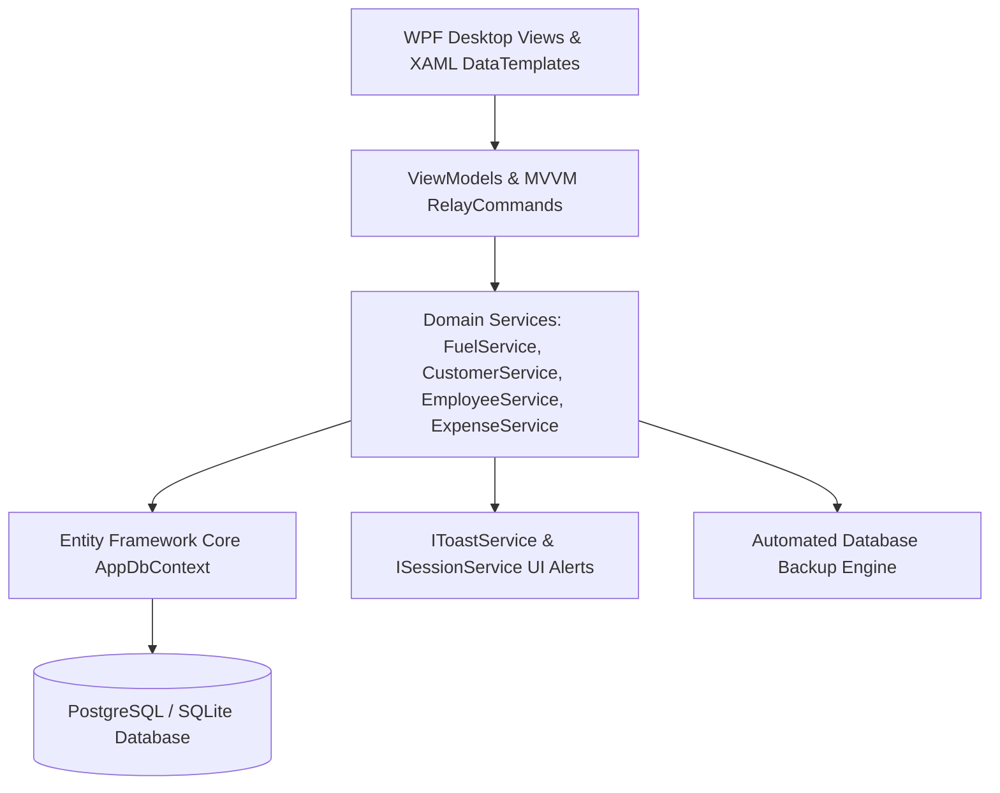

# PetroFlow — Petrol Pump ERP & Fuel Dispenser Management System

<div align="center">

[](https://github.com/abdussatarkhan)
[](https://github.com/abdussatarkhan)
[](https://github.com/abdussatarkhan)

</div>

[](https://github.com/abdussatarkhan/petrol-pump-Farooq/actions)
[](https://learn.microsoft.com/en-us/dotnet/desktop/wpf/)
[](https://learn.microsoft.com/en-us/dotnet/csharp/)
[](https://www.postgresql.org/)
[](https://learn.microsoft.com/en-us/dotnet/desktop/wpf/fundamentals/xaml)

> **A comprehensive enterprise desktop ERP application for fuel stations built in C# and WPF (.NET 8) following the MVVM architectural pattern with Entity Framework Core and PostgreSQL — managing multi-nozzle meter readings, underground tank ATG inventory, commercial customer credit accounts, and daily shift cash reconciliation.**

---

## 🏛️ System Architecture



---

## 🌟 Key Features & Capabilities

- **🖥️ WPF MVVM Desktop Architecture**: Modular architecture cleanly decoupling XAML view components from business ViewModels with dependency injection and value converters.
- **⛽ Multi-Nozzle Dispenser Logging**: Precise tracking of opening and closing meter readings across multiple fuel dispensers (Petrol, Diesel, High-Octane) with automated volume and revenue totals.
- **🛢️ Tank ATG & Inventory Reconciliation**: Compares underground storage tank dip stick readings against nozzle sales throughput to detect tank leakage or temperature variances.
- **💳 Commercial Credit Ledgers & Shifts**: Manages fleet credit accounts, employee shift handovers, daily operational expense recording, and end-of-shift drawer reconciliation.

---

## 🚀 Quickstart & Setup

### Prerequisites
- Windows 10/11
- [.NET 8 Desktop SDK](https://dotnet.microsoft.com/download/dotnet/8.0)
- Visual Studio 2022 (with .NET desktop development workload) or Visual Studio Code

### 1. Clone the Repository
```bash
git clone https://github.com/abdussatarkhan/petrol-pump-Farooq.git
cd petrol-pump-Farooq
```

### 2. Configure Database & Build

Update the connection string in `PetrolPumpMS.App/appsettings.json` with your PostgreSQL instance, then:

```bash
# Build the solution
dotnet build

# Launch the WPF Desktop Application
dotnet run --project PetrolPumpMS.App
```

---

## 🖥️ Application & Operational Interface

<p align="center">
  
</p>

> [!TIP]
> You can also explore [`dashboard.html`](dashboard.html) directly in any modern browser for a standalone interface walkthrough.

---

## 🗺️ Roadmap & Upcoming Enhancements

- [x] WPF (.NET 8) MVVM architecture with PostgreSQL & EF Core
- [x] Multi-nozzle dispenser meter logging and shift reconciliation
- [x] Customer credit ledger and employee expense management
- [ ] USB / Network ESC-POS thermal receipt printer integration
- [ ] Tank level automatic gauge interface (ATG) serial port reader
- [ ] End-of-day sales report export to Excel and PDF

---

## 👨‍💻 Author & Contact

Built and maintained by **Abdussatar** ([@abdussatarkhan](https://github.com/abdussatarkhan)).  
For technical discussions, collaboration, or queries, feel free to reach out via [LinkedIn](https://www.linkedin.com/in/abdus-satar-5150813b5/) or [GitHub](https://github.com/abdussatarkhan).

---

## 📜 License

This project is licensed under the **MIT License** — see the LICENSE file for details.

---

<div align="center">

### 👨‍💻 Maintained by [Abdussatar (@abdussatarkhan)](https://github.com/abdussatarkhan)
Part of the **[Abdussatar Software Engineering & Systems Portfolio](https://github.com/abdussatarkhan)**.

⭐ If you find this project valuable, consider dropping a star! ⭐

</div>
